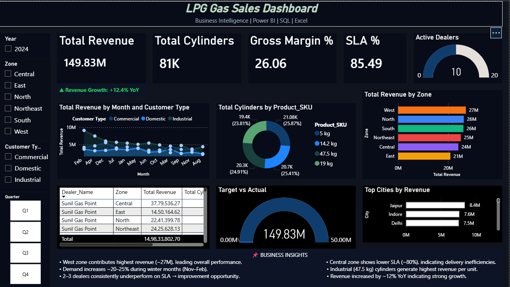

# LPG Gas Sales Dashboard — Power BI



## Live Dashboard
👉 **[View Live Dashboard](https://purvigit.github.io/LPG-Gas-Sales-Dashboard/)**

---

## Project Overview

End-to-end Business Intelligence dashboard built in Power BI for an LPG gas distribution business.
covers ₹423M revenue across 3 years (2024-2026), 6 zones, 10 dealers and 3 customer segments

---

## Tools Used

| Tool | Purpose |
|------|---------|
| Power BI Desktop | Dashboard building and visualizations |
| Power Query | Data cleaning and transformation |
| DAX | Calculated measures and KPIs |
| Excel | Raw data source — 4 sheets, 3,287 rows |

---

## Key Metrics

| Metric         | Value           |
|----------------|-----------------|
| Total Revenue  | ₹423M (3-year)  |
| Cylinders Sold | 2,22,000+       |
| Gross Margin % | 26.06%          |
| Delivery SLA % | 85.63%          |
| Active Dealers | 10              |
| Zones Covered  | 6               |

---

## Dashboard Features

- 5 KPI cards — Revenue, Cylinders, Gross Margin, SLA %, Active Dealers
- Line chart — Monthly revenue trend split by 3 customer types
- Donut chart — Product mix by cylinder size (5kg, 14.2kg, 19kg, 47.5kg)
- Horizontal bar chart — Zone-wise revenue with unique color per zone
- Dealer performance table — ranked by total revenue
- Gauge chart — Target vs Actual revenue
- Map visual — City-level revenue by bubble size
- 4 interactive slicers — Zone, Year, Customer Type, Quarter
- Business Insights text box — key findings written as analyst observations

---

## DAX Measures Written

```dax
Total Revenue = SUM(Sales_Transactions[Total_Revenue_INR])

Total Cylinders = SUM(Sales_Transactions[Quantity_Sold])

Gross Profit = SUM(Sales_Transactions[Gross_Profit_INR])

Gross Margin % = DIVIDE([Gross Profit], [Total Revenue], 0) * 100

SLA % = DIVIDE(
    COUNTROWS(FILTER(Sales_Transactions, Sales_Transactions[Delivery_Status] = "On-Time")),
    COUNTROWS(Sales_Transactions), 0) * 100

Revenue vs Target = [Total Revenue] - SUM(Monthly_Targets[Target_Revenue_INR])
```

---

## Data Model — 4 Tables

```
Sales_Transactions  →  Dealer_Master    (on Dealer_ID)
Sales_Transactions  →  Product_Master   (on Product_SKU)
Sales_Transactions  →  Monthly_Targets  (on Zone + Month)
```

---

## Business Insights Found

- West zone leads all regions at ₹75M — consistently 
  top performer across all 3 years
- Revenue grew year on year from 2024 to 2026 — 
  volume increased 30% and prices rose ~8% over 3 years
- Central zone SLA at ~80% across all years — 
  persistent delivery route problem, not a one-off issue
- Industrial 47.5kg cylinders generate highest revenue 
  per unit — margin opportunity across all 3 years
- Domestic segment spikes 20-25% every Nov-Feb — 
  winter demand pattern confirmed across 3 consecutive years
- SLA improved from 80% in 2024 to 89% in 2026 — 
  shows operational improvement over time
```

## Files in This Repository

| File | Description |
|------|-------------|
| `LPG Gas Sales Dashboard.pbix` | Power BI dashboard — open in Power BI Desktop |
| `LPG_Sales_Data.xlsx` | Raw dataset — 4 sheets, 9,049 rows across 2024-2026 |
| `Theme.json` | Custom dark navy theme — import in Power BI |
| `LPG_Gas_Sales_Dashboard.png` | Full resolution dashboard screenshot |
| `index.html` | GitHub Pages live preview page |

---

## How to Open Locally

1. Download `LPG Gas Sales Dashboard.pbix`
2. Open in **Power BI Desktop** (free download at powerbi.microsoft.com)
3. Data loads automatically from the Excel file
4. All slicers and visuals are interactive

---

## Connect

**Purvi Porwal**  
📧 purviporwal46@gmail.com  
🔗 [LinkedIn](https://www.linkedin.com/in/purvi-porwal-a6554a258)  
💻 [GitHub](https://github.com/PurviGit)
